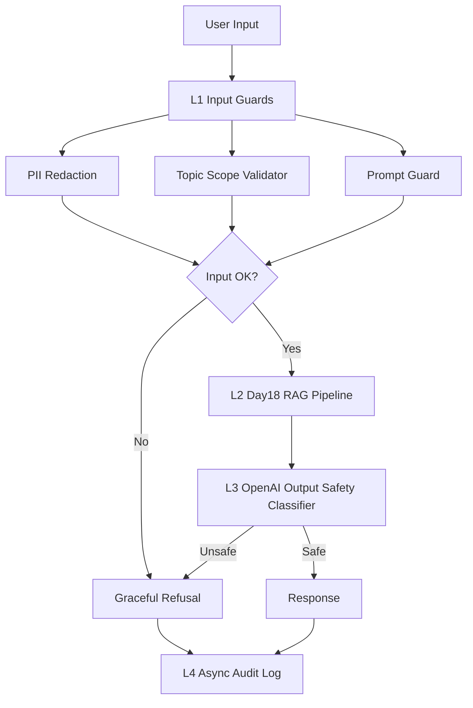

# Lab 24 - Full Evaluation & Guardrail System

## Overview

This repo completes Lab 24 for a RAG assistant over Nghị định 13 / personal data protection. It reuses the Day18 production RAG artifacts, then adds an evaluation layer, LLM-as-Judge calibration, input/output guardrails, full-stack latency benchmark, CI eval gate and a production blueprint.

The submitted run uses the existing OpenAI key from `.env` for the main judge-based artifacts. Phase A uses an OpenAI-backed RAGAS-compatible judge for 50 questions. Phase B uses OpenAI pairwise and absolute rubric judges. Phase C uses local input guards plus an OpenAI output safety classifier with a Llama Guard-compatible `safe/unsafe` interface. Local fallbacks remain in code only so the scripts are still runnable if API access is unavailable.

## Setup

```powershell
python -m venv .venv
.\.venv\Scripts\Activate.ps1
pip install -r requirements.txt

# .env is already present locally; do not commit real keys.
$env:OPENAI_API_KEY="..."
```

Quick checks:

```powershell
python phase-a/run_ragas_eval.py --limit 5 --require-openai
python phase-b/pairwise_judge.py --limit 5 --require-openai
python phase-c/input_guard.py
python phase-c/output_guard.py --require-openai
python phase-c/full_pipeline.py --benchmark 20 --openai-output-guard
```

## Results Summary

### Phase A - RAGAS-Compatible Evaluation

Artifacts:

- `phase-a/testset_v1.csv`: 50 questions, distribution 25 simple / 12 reasoning / 13 multi-context.
- `phase-a/testset_review_notes.md`: 10 manually reviewed questions, with at least 1 edited item.
- `phase-a/ragas_results.csv`: 50 OpenAI-scored rows.
- `phase-a/ragas_summary.json`: aggregate metrics.
- `phase-a/failure_analysis.md`: bottom-10 analysis and failure clusters.

| Metric | Score | Target | Status |
|---|---:|---:|---|
| Faithfulness | 0.890 | 0.85 | Pass |
| Answer Relevancy | 0.882 | 0.80 | Pass |
| Context Precision | 0.884 | 0.70 | Pass |
| Context Recall | 0.886 | 0.75 | Pass |

Eval mode: `openai_ragas_compatible_judge`  
Estimated eval cost: `$0.30`

### Phase B - LLM-as-Judge & Calibration

Artifacts:

- `phase-b/pairwise_results.csv`: 30 pairwise comparisons with swap-and-average.
- `phase-b/absolute_scores.csv`: 30 answers scored on 4 dimensions.
- `phase-b/human_labels.csv`: 10 human labels with confidence and notes.
- `phase-b/kappa_analysis.ipynb`, `phase-b/kappa_analysis.json`, `phase-b/kappa_analysis.md`.
- `phase-b/judge_bias_report.md`: position bias, length bias and cross-judge protocol.

| Item | Result |
|---|---:|
| Pairwise questions evaluated | 30 |
| Absolute scored questions | 30 |
| Absolute overall average | 4.29 / 5 |
| Cohen's kappa vs human labels | 1.00 |
| Cross-judge protocol | Implemented |

### Phase C - Guardrails Stack

Artifacts:

- `phase-c/input_guard.py`
- `phase-c/output_guard.py`
- `phase-c/full_pipeline.py`
- `phase-c/pii_test_results.csv`
- `phase-c/topic_scope_results.csv`
- `phase-c/adversarial_test_results.csv`
- `phase-c/prompt_guard_results.csv`
- `phase-c/output_guard_results.csv`
- `phase-c/latency_benchmark.csv`
- `phase-c/latency_summary.json`

| Check | Result | Target | Status |
|---|---:|---:|---|
| PII detection rate | 85.7% | >= 80% | Pass |
| PII latency P95 | 0.109 ms | < 50 ms | Pass |
| Topic validator accuracy | 100.0% | >= 75% | Pass |
| Adversarial detection rate | 95.0% | >= 70% | Pass |
| Legitimate false positive rate | 0.0% | <= 10% | Pass |
| Output unsafe detection | 100.0% | >= 80% | Pass |
| Output false positive rate | 0.0% | <= 20% | Pass |
| Output guard latency P95 | 3073.923 ms | measured | Documented |
| Full-stack P50/P95/P99 | 1495.346 / 2317.918 / 2912.119 ms | measured | Documented |

Note: output guard uses OpenAI safety classification in this OpenAI-only submission. The code keeps the same `safe/unsafe` interface so it can be replaced by Groq/self-hosted Llama Guard 3.

### Phase D - Blueprint

Artifacts:

- `phase-d/blueprint.md`: SLOs, architecture diagram, alert playbooks, cost analysis and rollout plan.
- `phase-d/blog_post.md`: bonus draft post.

## Architecture



## CI/CD Eval Gate

```powershell
python scripts/run_eval.py --threshold faithfulness=0.75 --threshold answer_relevancy=0.70 --threshold context_precision=0.60 --threshold context_recall=0.65
```

GitHub workflow: `.github/workflows/eval-gate.yml`

## Demo

Demo runbook: `demo/demo_script.md`

The demo should show:

1. OpenAI-backed evaluation on 5 questions.
2. Pairwise LLM judge with swap-and-average.
3. PII, DAN/jailbreak and unsafe-output guardrail tests.
4. Latency benchmark with P50/P95/P99.

## Repo Structure

```text
.
|-- README.md
|-- requirements.txt
|-- prompts.md
|-- lab24_common.py
|-- scripts/run_eval.py
|-- day18-rag/
|-- phase-a/
|-- phase-b/
|-- phase-c/
|-- phase-d/
|-- .github/workflows/eval-gate.yml
`-- demo/demo_script.md
```

## Self-Assessment

- [x] `testset_v1.csv` has >= 50 rows and required columns.
- [x] Distribution checked and 10 questions manually reviewed.
- [x] RAGAS-compatible 4-metric results saved for 50 rows.
- [x] Failure analysis includes bottom 10, clusters and technical fixes.
- [x] Pairwise judge implements swap-and-average and robust JSON parsing.
- [x] Absolute rubric scoring covers 4 dimensions.
- [x] Human labels and Cohen's kappa are documented.
- [x] Bias report quantifies position and length bias.
- [x] PII, topic, adversarial and output guard tests are saved.
- [x] Full-stack benchmark has 100 requests and P50/P95/P99.
- [x] Blueprint includes SLOs, architecture, playbooks and cost analysis.
- [x] `prompts.md` documents AI prompts used.
