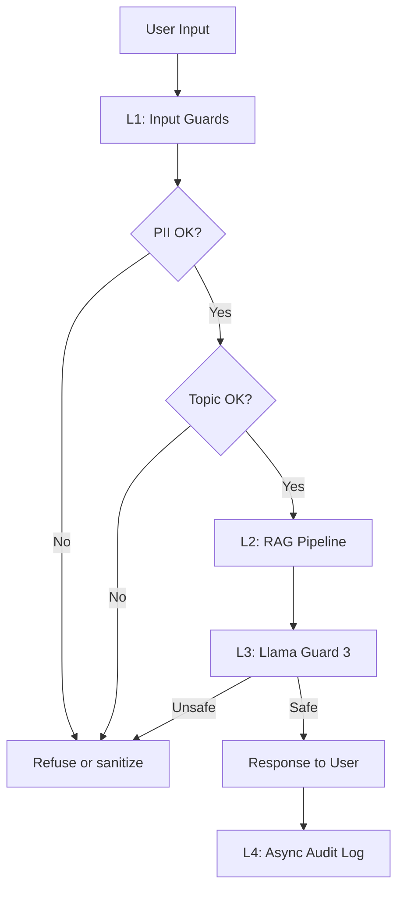

# Lab 24 - Full Evaluation & Guardrail System

## Overview

Lab 24 xây dựng một hệ thống evaluation và guardrail hoàn chỉnh cho RAG pipeline từ Day 18. Mục tiêu của repo không chỉ là chứng minh pipeline "chạy được", mà là đo được chất lượng, phát hiện lỗi, giảm rủi ro khi có input xấu và có đủ tín hiệu để vận hành như một hệ thống production-ready. Phần evaluation dùng RAGAS để tạo test set tổng hợp 50 câu hỏi từ corpus, chạy 4 metric chính gồm faithfulness, answer relevancy, context precision và context recall, sau đó phân tích các failure cluster để biết pipeline yếu ở retrieval, generation hay dữ liệu.

Repo cũng triển khai LLM-as-Judge để so sánh hai version của RAG, dùng swap-and-average để giảm position bias, absolute scoring bằng rubric 4 chiều và human calibration bằng Cohen's kappa. Phần guardrails xây dựng defense-in-depth gồm input guardrail để redact PII và validate topic scope, adversarial testing, output safety check bằng Llama Guard 3/Groq API, audit log và latency benchmark end-to-end. Kết quả cuối cùng được tổng hợp trong blueprint document với SLO, architecture diagram, alert playbook và cost analysis. Sau khi hoàn thành, repo trả lời được 3 câu hỏi chính: hệ thống có hoạt động tốt không, có chống chịu được tấn công không, và khi hỏng thì mình có biết kịp không.

## Deliverables

- GitHub repo đúng cấu trúc lab.
- `README.md` mô tả cách setup, chạy và đọc kết quả.
- `requirements.txt` với phiên bản package được pin.
- `prompts.md` ghi lại prompt/AI assistant đã dùng.
- Artifacts cho Phase A, B, C và D.
- Demo video 5 phút hoặc link YouTube unlisted.

## Repo Structure

```text
lab24-eval-guardrails-<ten-cua-ban>/
|-- README.md
|-- requirements.txt
|-- prompts.md
|-- phase-a/
|   |-- testset_v1.csv
|   |-- testset_review_notes.md
|   |-- ragas_results.csv
|   |-- ragas_summary.json
|   `-- failure_analysis.md
|-- phase-b/
|   |-- pairwise_results.csv
|   |-- absolute_scores.csv
|   |-- human_labels.csv
|   |-- kappa_analysis.ipynb
|   `-- judge_bias_report.md
|-- phase-c/
|   |-- input_guard.py
|   |-- output_guard.py
|   |-- full_pipeline.py
|   |-- pii_test_results.csv
|   |-- adversarial_test_results.csv
|   `-- latency_benchmark.csv
|-- phase-d/
|   `-- blueprint.md
|-- .github/workflows/
|   `-- eval-gate.yml
`-- demo/
    `-- demo-video.mp4
```

## Setup

Yêu cầu: Python 3.10+, RAG pipeline từ Day 18 chạy được retrieval + generation, document corpus ít nhất 50 trang text/markdown, OpenAI hoặc Anthropic key cho judge, và Groq/Hugging Face token nếu dùng Llama Guard.

```powershell
python -m venv .venv
.\.venv\Scripts\Activate.ps1
pip install -r requirements.txt

$env:OPENAI_API_KEY="..."
$env:GROQ_API_KEY="..."
$env:HUGGINGFACEHUB_API_TOKEN="..."
```

Kiểm tra nhanh trước khi chạy lab:

```powershell
python --version
pip list | findstr "ragas presidio guardrails transformers"
python -c "import ragas; print(ragas.__version__)"
python -m your_rag_module.test_query "What is X?"
```

## How To Run

Các lệnh dưới đây là runbook dự kiến. Nếu tên script trong repo khác, cập nhật lại command tương ứng sau khi implement.

```powershell
# Phase A - RAGAS evaluation
python phase-a/generate_testset.py
python phase-a/run_ragas_eval.py
python phase-a/analyze_failures.py

# Phase B - LLM-as-Judge and calibration
python phase-b/pairwise_judge.py
python phase-b/absolute_scoring.py
python phase-b/compute_kappa.py

# Phase C - Guardrails and latency
python phase-c/input_guard.py
python phase-c/output_guard.py
python phase-c/full_pipeline.py --benchmark 100

# Optional CI gate
python scripts/run_eval.py --threshold faithfulness=0.85
```

## Results Summary

### Phase A - RAGAS

Test set target: 50 questions with 50% simple, 25% reasoning and 25% multi-context questions.

| Metric | Score | Target | Min OK |
|---|---:|---:|---:|
| Faithfulness | TBD | 0.85 | 0.75 |
| Answer Relevancy | TBD | 0.80 | 0.70 |
| Context Precision | TBD | 0.70 | 0.60 |
| Context Recall | TBD | 0.75 | 0.65 |

Artifacts:

- `phase-a/testset_v1.csv`
- `phase-a/testset_review_notes.md`
- `phase-a/ragas_results.csv`
- `phase-a/ragas_summary.json`
- `phase-a/failure_analysis.md`

Failure clusters identified: TBD  
Total eval cost: TBD

### Phase B - LLM-as-Judge

Pairwise judge compares two RAG versions and applies swap-and-average to reduce position bias. Absolute scoring uses a 4-dimension rubric: factual accuracy, relevance, conciseness and helpfulness.

| Item | Result |
|---|---|
| Pairwise questions evaluated | TBD |
| Absolute scored questions | TBD |
| Cohen's kappa vs human labels | TBD |
| Position bias observation | TBD |
| Length bias observation | TBD |

Artifacts:

- `phase-b/pairwise_results.csv`
- `phase-b/absolute_scores.csv`
- `phase-b/human_labels.csv`
- `phase-b/kappa_analysis.ipynb`
- `phase-b/judge_bias_report.md`

### Phase C - Guardrails

Guardrail stack:

1. Input layer: PII redaction with Presidio + Vietnamese regex.
2. Input layer: topic scope validator.
3. Input layer: adversarial/jailbreak detection.
4. LLM layer: Day 18 RAG pipeline.
5. Output layer: Llama Guard 3 or Groq API safety check.
6. Audit layer: async logging, not counted in latency budget.

| Check | Result | Target |
|---|---:|---:|
| PII detection rate | TBD | >= 80% |
| PII latency P95 | TBD | < 50ms |
| Topic validator accuracy | TBD | >= 75% |
| Adversarial detection rate | TBD | >= 70% |
| Legitimate query false positive rate | TBD | <= 10% |
| Output guard unsafe detection | TBD | >= 80% |
| Output guard false positive rate | TBD | <= 20% |
| L1 latency P95 | TBD | < 50ms |
| L3 latency P95 | TBD | < 100ms |
| End-to-end P50/P95/P99 | TBD | documented |

Artifacts:

- `phase-c/pii_test_results.csv`
- `phase-c/adversarial_test_results.csv`
- `phase-c/latency_benchmark.csv`

### Phase D - Blueprint

Blueprint target: Markdown or PDF, 4-6 pages, production-ready.

Must include:

- At least 5 SLOs with alert thresholds.
- Architecture diagram with 4 defense layers and latency annotation.
- At least 3 alert playbook incidents.
- Monthly cost estimate and optimization opportunities.

Main artifact: `phase-d/blueprint.md`

## Architecture



## Demo Video

Demo video cần show đủ 4 phần trong khoảng 5 phút:

1. RAGAS chạy live trên 5 questions.
2. LLM-Judge so sánh 2 versions.
3. Adversarial test với 3 attacks: DAN, jailbreak, PII.
4. Latency benchmark output với P50/P95/P99.

Link demo: TBD

## Self-Assessment Checklist

- [ ] `testset_v1.csv` có >= 50 rows và đủ cột `question`, `ground_truth`, `contexts`, `evolution_type`.
- [ ] Distribution test set đúng 50/25/25 và đã manual review >= 10 questions.
- [ ] `ragas_results.csv` có đủ 4 metric columns cho 50 rows.
- [ ] `ragas_summary.json` có aggregate scores.
- [ ] `failure_analysis.md` có bottom 10 questions, >= 2 clusters và proposed fixes cụ thể.
- [ ] `.github/workflows/eval-gate.yml` valid YAML, có threshold gate và upload artifact.
- [ ] Pairwise judge chạy >= 30 questions, JSON parse robust, có swap-and-average.
- [ ] `human_labels.csv` có 10 labels với confidence và notes.
- [ ] Cohen's kappa được compute và diễn giải đúng.
- [ ] `judge_bias_report.md` quantify >= 2 biases bằng số liệu.
- [ ] PII guard test 10 inputs, detection rate >= 80%, P95 < 50ms.
- [ ] Topic validator test 20 inputs, accuracy >= 75%, fallback message lịch sự.
- [ ] 20 adversarial inputs tested, detection rate >= 70%.
- [ ] Llama Guard chạy được, test 10 unsafe + 10 safe outputs.
- [ ] Full stack chạy end-to-end, benchmark >= 100 requests, report P50/P95/P99.
- [ ] `blueprint.md` có SLOs, architecture diagram, alert playbook và cost analysis.
- [ ] `prompts.md` ghi lại AI prompts đã dùng.
- [ ] Demo video/link được thêm vào README.

## Notes

- Nếu không có GPU, dùng Groq API cho Llama Guard 3.
- Nếu RAGAS chạy quá lâu, giảm `max_concurrent` xuống 2 hoặc dùng `gpt-4o-mini`.
- Lock model/version của judge để kết quả reproducible giữa các lần chạy.
- Test set quality quan trọng: review thủ công ít nhất 20% nếu output nhiễu.
- Nếu Cohen's kappa < 0.6, cần phân tích root cause: position bias, length bias, style bias hoặc human labels chưa nhất quán.
- Không skip `prompts.md`; đây là phần kiểm tra academic integrity.
