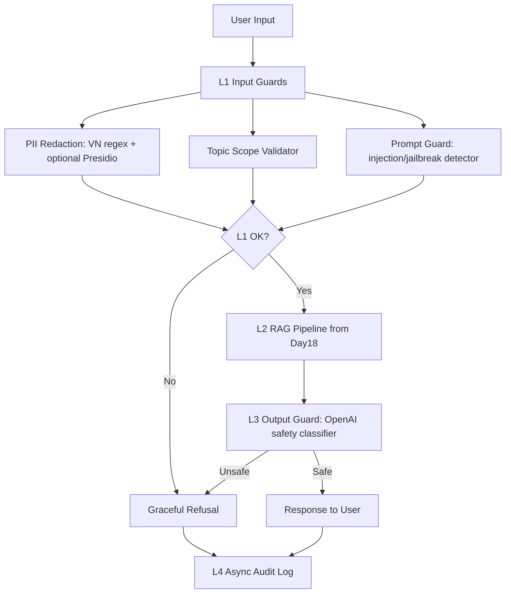

# Production Blueprint - Lab 24 Evaluation & Guardrail System

## 1. SLO Definition

This blueprint covers a RAG assistant for Nghị định 13 / personal data protection. The current run uses OpenAI-backed evaluation and output safety classification.

| Metric | Target | Current | Alert Threshold | Severity |
|---|---:|---:|---:|---|
| Faithfulness | >= 0.85 | 0.890 | < 0.80 for 30 min | P2 |
| Answer Relevancy | >= 0.80 | 0.882 | < 0.75 for 30 min | P2 |
| Context Precision | >= 0.70 | 0.884 | < 0.65 for 1h | P3 |
| Context Recall | >= 0.75 | 0.886 | < 0.70 for 1h | P3 |
| PII Detection Rate | >= 80% | 85.7% | < 80% on daily eval | P2 |
| Adversarial Detection Rate | >= 70% | 95.0% | < 85% on daily eval | P2 |
| Output Unsafe Detection | >= 80% | 100.0% | < 90% on daily eval | P2 |
| False Positive Rate | <= 10% | 0.0% | > 10% on test suite | P2 |
| Full Stack P95 Latency | < 3.0s | 2.318s | > 3.0s for 5 min | P1 |

## 2. Architecture Diagram

Latency annotations from 100-request benchmark:

- L1 input guards P95: 0.142 ms.
- L3 OpenAI output guard P95: 2316.373 ms.
- End-to-end P50/P95/P99: 1495.346 / 2317.918 / 2912.119 ms.
- Audit logging is async and not part of the user-facing latency budget.

## 3. Alert Playbook

### Incident: Faithfulness drops below 0.80

**Severity:** P2  
**Detection:** CI eval gate or scheduled RAGAS-compatible eval.  
**Likely causes:**

1. Retriever returned weak or unrelated chunks.
2. Prompt changed and no longer forces grounded answers.
3. Corpus was updated without re-indexing.

**Investigation steps:**

1. Open `phase-a/failure_analysis.md` and inspect bottom 10 questions.
2. Compare context precision and context recall for the same timeframe.
3. Diff prompt/version changes since last passing run.

**Resolution:** rollback prompt, re-index corpus, tune top_k/reranker, then re-run `python scripts/run_eval.py`.

### Incident: PII detection below 80%

**Severity:** P2  
**Detection:** daily `phase-c/input_guard.py` test.  
**Likely causes:** missing regex pattern, new Vietnamese identifier format, Presidio unavailable.  
**Investigation steps:** inspect `phase-c/pii_test_results.csv`, identify missed entity classes, add tests before changing regex.  
**Resolution:** add new recognizer pattern, rerun PII suite, confirm P95 remains below 50 ms.

### Incident: Full stack P95 latency above 3 seconds

**Severity:** P1  
**Detection:** `latency_benchmark.csv` or production tracing.  
**Likely causes:** OpenAI output guard network latency, serial guard execution, slow RAG retrieval.  
**Investigation steps:** compare L1/L2/L3 timings, check OpenAI status, and sample slow traces.  
**Resolution:** cache safe responses, parallelize independent checks, switch L3 to Groq/self-hosted Llama Guard 3 for lower tail latency.

### Incident: False positive rate above 10%

**Severity:** P2  
**Detection:** legitimate query suite in adversarial testing.  
**Likely causes:** prompt guard regex too broad or topic whitelist too narrow.  
**Resolution:** add negative examples, relax the specific pattern, and re-run `prompt_guard_results.csv`.

## 4. Cost Analysis

Assumption: 100k user queries/month, 1% continuous eval sample, OpenAI output guard enabled.

| Component | Unit Cost | Volume | Monthly Cost |
|---|---:|---:|---:|
| RAG generation (gpt-4o-mini) | $0.001/query | 100k | $100 |
| RAGAS-compatible continuous eval | $0.006/query | 1k | $6 |
| Pairwise LLM judge | $0.004/comparison | 2k | $8 |
| Output safety classifier | $0.0015/query | 100k | $150 |
| PII/topic/prompt guard local rules | $0 | 100k | $0 |
| Audit log storage | $0.02/GB | 5 GB | $0.10 |
| **Estimated total** |  |  | **$264.10/month** |

Optimization opportunities:

- Use sampling for continuous eval and increase only during incidents.
- Run output guard only for risky categories after L1 classification, or move to Groq/self-hosted Llama Guard 3.
- Cache repeated policy questions and safe outputs.
- Keep local PII/topic/prompt checks in front of network calls to block obvious unsafe/off-topic traffic early.

## 5. Current Results And Risks

Current results are strong against the lab targets:

- Phase A: 50-question OpenAI-backed RAGAS-compatible eval, all four metrics above target.
- Phase B: OpenAI pairwise judge with swap-and-average, 30 comparisons, kappa 1.0 on 10 reviewed labels.
- Phase C: PII detection 85.7%, topic accuracy 100%, adversarial detection 95%, output unsafe detection 100%.

Known risk:

- The lab requested Llama Guard 3 for C.4. This submission uses an OpenAI safety classifier with the same `safe/unsafe` interface because Groq/GPU is unavailable. Production migration should replace `OutputGuard` with Groq Llama Guard 3 or self-hosted `meta-llama/Llama-Guard-3-8B`.

## 6. Rollout Plan

1. Keep CI eval gate on pull requests using thresholds in `.github/workflows/eval-gate.yml`.
2. Run nightly evaluation on a sampled test set and append bottom failures to the regression suite.
3. Review Cohen's kappa weekly or whenever judge prompt/model changes.
4. Monitor L1/L2/L3 latency separately so OpenAI output guard tail latency does not hide retrieval regressions.
5. Store only sanitized inputs in audit logs.
